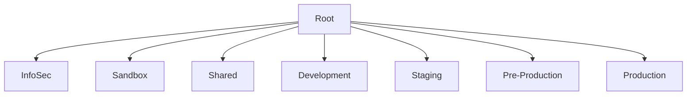

# 🛡️ AWS Multi-Account Guardrails — Terraform + Terragrunt

[](https://github.com/hexhaust/02-aws-multiaccount-guardrails/actions/workflows/ci.yaml)


Production-ready **guardrails** for an AWS multi-account organization using **Terraform + Terragrunt**.

---

## 🚀 Landing Zone Flavors

This repo supports **both**:

1. **Control Tower–aligned** (`stacks/control-tower/*`) — assumes CT is deployed and manages baseline OUs/accounts, while this repo manages guardrails, services and attachments.
2. **Vanilla Terraform** (`stacks/vanilla/*`) — creates/manages Organizations, OUs, and guardrails without Control Tower.

Choose per environment by pointing Terragrunt `source` to the desired stack.

---

## 🏢 OU Layout



* **InfoSec** — Delegated admin for GuardDuty, Security Hub, Config Aggregator, Access Analyzer
* **Sandbox**
* **Shared**
* **Development**
* **Staging**
* **Pre-Production**
* **Production**

---

## 🚧 Region Restriction (SCP)

Default allowed regions:

```
us-east-1, us-west-2, ap-northeast-1, ap-southeast-1, eu-central-1
```

Per-account overrides are supported via Terragrunt input `extra_allowed_regions` in each account's `terragrunt.hcl`.

---

### 📝 How to Request Extra Region Access

1. Fork the repo and create a branch:

   ```bash
   git checkout -b feat/extra-region-myaccount
   ```
2. Edit the account’s `terragrunt.hcl` (example: `envs/Production/app1/terragrunt.hcl`):

   ```hcl
   inputs = {
     extra_allowed_regions = ["eu-west-1"]
   }
   ```
3. Commit & push:

   ```bash
   git commit -am "feat: allow eu-west-1 for app1"
   git push origin feat/extra-region-myaccount
   ```
4. Open a Pull Request — after approval & merge, CI will update the SCP.

---

## 🔐 Security Services (Org-wide)

* **CloudTrail (Org Trail)** with KMS + S3 in Log Archive
* **AWS Config** aggregator in InfoSec
* **GuardDuty** delegated admin + auto-enable to all accounts
* **Security Hub** standards: AWS Foundational Best Practices + CIS 1.4
* **Access Analyzer** at org-level
* **Identity Center** permission sets (starter set)

---

## 📦 What’s Included

* Service Control Policies (SCPs) for root account lock-down, MFA, region restrictions, etc.
* Terraform modules for each org-wide service
* Terragrunt environment structure aligned to OUs
* CI pipeline with fmt / validate / tflint / tfsec / checkov
* Example per-account overrides via Terragrunt inputs

### ❌ What’s Not (Yet)

* Actual AWS account creation (Control Tower or vanilla)
* Automated IAM role creation for service delegation (Config, GuardDuty, Security Hub)
* Auto-remediation Lambda/SSM runbooks

---

## ✔️ Optional: Pre-commit Hooks

You can optionally install `pre-commit` hooks to auto-run Terraform lint, security checks, and OPA tests before each commit:

```bash
pip install pre-commit
pre-commit install
```

---

## 🛠️ Getting Started

```bash
# 1) Clone repo
git clone https://github.com/<YOUR_GITHUB_USER>/02-aws-multiaccount-guardrails.git
cd 02-aws-multiaccount-guardrails

# 2) Navigate to an env and run a plan
cd envs/org-root
terragrunt run-all plan

# 3) Apply with approvals
terragrunt run-all apply
```

---

## 💡 Per-account Region Override Example

Example in `envs/Production/app1/terragrunt.hcl`:

```hcl
inputs = {
  extra_allowed_regions = ["eu-west-1"]
}
```

The final policy will allow base + extra list for that account only.
